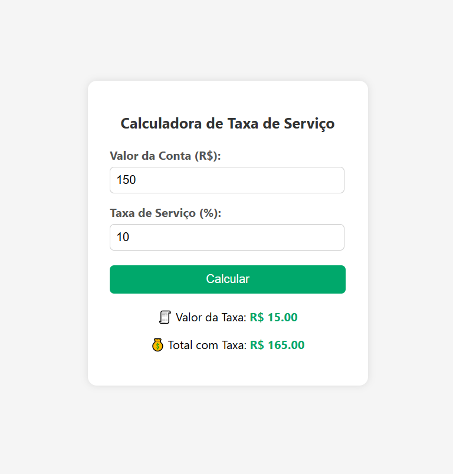

# 🧮 Calculadora de Taxa de Serviço

Uma calculadora simples feita com HTML, CSS e JavaScript para calcular a taxa de serviço (%), muito útil para bares, restaurantes e eventos.

## 📸 Captura de Tela

 <!-- Adicione uma imagem se quiser -->

## 🚀 Funcionalidades

- Entrada do valor da conta.
- Entrada da taxa de serviço (%).
- Exibe valor da taxa e total com a taxa incluída.
- Responsivo e fácil de usar.

## 🛠 Tecnologias

- HTML5
- CSS3
- JavaScript (Vanilla)

## 📂 Como usar

1. Clone o repositório:
```bash
git clone https://github.com/JEAN-ALMEIDA-CZO/calculataxa.git
